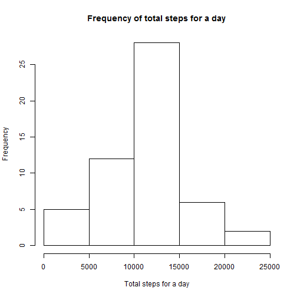
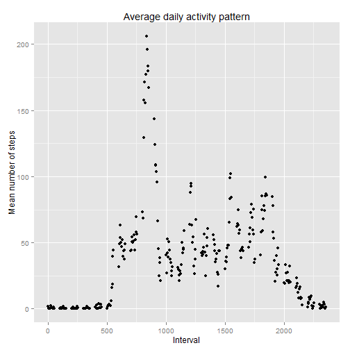
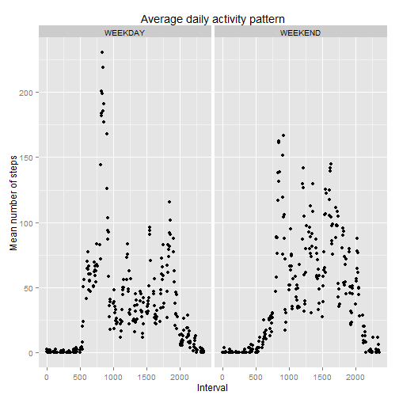

#Reproducible Research: Peer Assessment 1
*Author*: Per Rynning

This document details my submission for course project 1 in the Reproducible Research course. 

The goal of the project is to download and analyze Acivity monitoring data and answer the following main questions: 

- What is mean total number of steps taken per day?
- What is the average daily activity pattern?
- Are there differences in activity patterns between weekdays and weekends?

To start off we will load the required libraries:


```r
library(lubridate)
library(timeDate)
library(stringr)
library(plyr)
library(dplyr)
library(ggplot2)
```

Next step is to download the data from <https://d396qusza40orc.cloudfront.net/repdata%2Fdata%2Factivity.zip> unless it is already present in the current working directory.


```r
## Downloads dataset if not available in the current folder
if(!file.exists("repdata-data-activity.zip") && !file.exists("activity.csv")){
    download.file("https://d396qusza40orc.cloudfront.net/repdata%2Fdata%2Factivity.zip", 
                  destfile = "repdata-data-activity.zip")
    
    dateDownloaded <- date()
    
    unzip("repdata-data-activity.zip")
}
```

We read the data using *read.csv* 


```r
## Reads the data from file
activity <- read.csv(file = "activity.csv", 
                     header = T)
```

We create a new column, *datetime*, by combining the *date* and *interval* fields, and convert this so that we have a POSIX date for each entry. 


```r
## Creates datetime column combining date and interval to POSIX date
activity$datetime <- paste(activity$date, 
                           str_pad(activity$interval, 
                                   width = 4, 
                                   side="left", 
                                   pad="0"))

activity$datetime <- ymd_hm(activity$datetime)
```

## Mean total number of steps

To make a histogram of total number of steps pr day we create a new data frame called *steps_pr_day*

```r
## Finds nr of steps pr day

steps_pr_day <- group_by(activity, 
                         date) %>% 
    summarise(totalsteps = sum(steps))
```

We then get this histogram showing total number of steps pr day  and the frequency.
**Note**: For this part of the exercise we have ignored missing values in the dataset. 

```r
hist(steps_pr_day$totalsteps, 
     main = "Frequency of total steps for a day", 
     xlab = "Total steps for a day")
```

 

The mean and median steps per day are


```r
## Mean steps per day
mean(steps_pr_day$totalsteps, na.rm = T)
```

```
## [1] 10766.19
```

```r
## Median steps per day
median(steps_pr_day$totalsteps, na.rm = T)
```

```
## [1] 10765
```

## Average daily activity pattern

We'd like to see how the average daily activity pattern is. We can do this by grouping the data on the intervals.


```r
steps_pr_interval <- group_by(activity, 
                              interval) %>% 
    summarise(meansteps = mean(steps, 
                               na.rm = T))

## Uses qplot to plot the average daily activity pattern
qplot(interval, 
      meansteps, 
      data = steps_pr_interval, 
      type="line", 
      ylab = "Mean number of steps", 
      xlab = "Interval", 
      main = "Average daily activity pattern")
```

 

### Missing values
The activity dataset we are working with currently has many missing values


```r
## Sums up missing values from activity$steps
sum(is.na(activity$steps))
```

```
## [1] 2304
```

We will use the mean steps per interval to fill in for the missing values, and see how this affects our results


```r
## Copies activity dataset
activity_mean_na <- activity

## Replaces all NA values with values from steps_pr_interval matched on interval number
activity_mean_na$steps[which(is.na(activity_mean_na$steps))] <-
    steps_pr_interval$meansteps[match(activity_mean_na$interval, 
                                      steps_pr_interval$interval)]
```

The updated histogram we get over Frequency of total steps with NAs replaced looks like this:


```r
## Groups to find new total steps pr day
steps_pr_day_nas_replaced <- group_by(activity_mean_na, 
                         date) %>% 
    summarise(totalsteps = sum(steps))

## Creates histogram
hist(steps_pr_day_nas_replaced$totalsteps, 
     main = "Frequency of total steps for a day (NAs replaced with means)", 
     xlab = "Total steps for a day")
```

 

Let's have a look at how the mean and median values have changed


```r
## Mean steps per day
mean(steps_pr_day_nas_replaced$totalsteps)
```

```
## [1] 10766.19
```

```r
## Median steps per day
median(steps_pr_day_nas_replaced$totalsteps)
```

```
## [1] 10766.19
```

We can see that the mean steps per day has not changed, but the median is now the same as the mean. 

## Differences in activity patterns between weekdays and weekends

In this section we will look at how activity differs between weekdays and weekend

This section will utilize the dataset where NAs are replaced with mean values, as this may provide a more realistic basis for comparison.


```r
## Sets locale so that we get English names of days instead of Norwegian for our plots
Sys.setlocale("LC_TIME", "C")
```

```
## [1] "C"
```

```r
## Using the previously created datetime column we can create a new column indicating if we are looking at a weekday or weekend. This creates a column which has true values for dates that are on a weekday
activity_mean_na$weekday <- isWeekday(activity_mean_na$datetime, 
                                      wday=1:5)

## We'll relable the true/false values to WEEKEND or WEEKDAY
activity_mean_na$weekday <- mapvalues(activity_mean_na$weekday, from=c(TRUE, FALSE), to=c("WEEKDAY", "WEEKEND"))

## We'll create a summary grouped by interval and weekdays/weekenda
steps_pr_interval_nas_replaced <- group_by(activity_mean_na, 
                              interval,
                              weekday) %>% 
    summarise(meansteps = mean(steps))

## We'll plot the data differenciated on weekend/weekdays
meansteps_plot <- qplot(interval, 
                        meansteps, 
                        data=steps_pr_interval_nas_replaced, 
                        type="line",
                        ylab = "Mean number of steps", 
                        xlab = "Interval", 
                        main = "Average daily activity pattern")
meansteps_plot + facet_grid(. ~ weekday)
```

 
